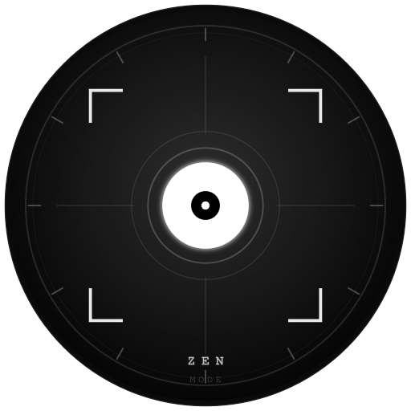

<div style="text-align: center">
    
</div>

# Zen Mode

Focus mode chrome extension that you can block websites up to 5000 domains([determined by Chrome](https://developer.chrome.com/docs/extensions/reference/declarativeNetRequest/#property-MAX_NUMBER_OF_DYNAMIC_AND_SESSION_RULES)).

[](https://github.com/zen-suite/focus-mode-extension/actions/workflows/release.yaml)

## Download and Install

Head over to the [releases](https://github.com/zen-suite/focus-mode-extension/releases) page to download extension. After downloading zip file, unzip the file. Then, follow instruction [here](https://developer.chrome.com/docs/extensions/mv3/getstarted/development-basics/#load-unpacked) to load unpack extension.

## Feedback or bug report?

If you have feature requests, feedback or bug report, please head over to the [issues page](https://github.com/zen-suite/focus-mode-extension/issues/new/choose) and create either `Bug Report` or `Feature Request` issue.

## Development

### Prerequisites

- Node Version Manager (NVM)

### Install Node

```
nvm install
```

### Install yarn

```
npm i -g yarn
```

### Install Dependencies

```
yarn
```

### Run Dev server

This will run dev server that will hot reload changes to chrome extension.

```
yarn dev
```

After running dev server, you can install `dist` directory as chrome extension using [load unpack extension](https://developer.chrome.com/docs/extensions/mv3/getstarted/development-basics/#load-unpacked).
