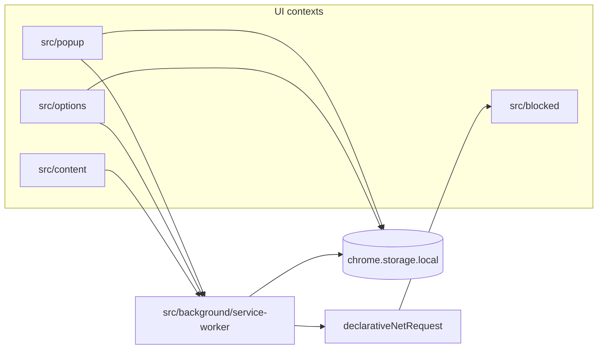

# Project folder structure

Zen Mode is a **Chrome Manifest V3 extension** built with React, TypeScript, and Vite (`@crxjs/vite-plugin`). The layout separates extension entry points, shared UI, domain logic, and tooling.

## Top-level overview

```
focus-mode-extension/
├── src/                 # Extension source (main codebase)
├── public/              # Static assets bundled into the extension
├── website/             # Privacy policy site (GitHub Pages; not in extension build)
├── docs/                # Project documentation and dev screenshots
├── .github/             # CI/CD workflows and issue templates
├── .storybook/          # Storybook configuration
├── .vscode/             # Recommended editor settings
├── agents/              # Agent skills (e.g. release notes)
├── manifest.ts          # Chrome extension manifest (TypeScript)
├── index.html           # Popup HTML entry (toolbar icon)
├── vite.config.ts       # Vite + CRX build and Vitest
├── vitest.setup.ts      # Test mocks (Chrome APIs)
├── package.json         # Scripts and dependencies
├── AGENTS.md            # Contributor / AI agent guide (architecture, commands)
├── DESIGN.md            # UI design reference (grayscale, patterns)
└── dist/                # Production build output (generated; load unpacked in Chrome)
```

After `yarn dev` or `yarn build`, install or reload the extension from **`dist/`**.

## Extension entry points (`src/`)

Chrome runs several isolated contexts. Each has its own bundle and HTML where applicable.

| Path                               | Chrome role                               | Purpose                                               |
| ---------------------------------- | ----------------------------------------- | ----------------------------------------------------- |
| `src/popup/`                       | Action popup (`index.html` → `main.tsx`)  | Quick actions: block current site, open options       |
| `src/options/`                     | Options page (`index.html`)               | Full settings: blocked sites, breaks, Pomodoro        |
| `src/background/service-worker.ts` | Service worker                            | Blocking rules, alarms, break state, message handling |
| `src/content/`                     | Content script (`main.tsx` on http/https) | In-page UI: break popups, blocked-state overlays      |
| `src/blocked/`                     | Blocked redirect page (`index.html`)      | Page shown when navigation is redirected to a block   |

`manifest.ts` wires these paths to permissions, content scripts, and `web_accessible_resources`.

## `src/` layout in detail

```
src/
├── background/          # Service worker only
├── popup/               # Toolbar popup UI
├── options/             # Full-page settings
│   ├── pomodoro/        # Pomodoro timer settings section
│   ├── settings/        # General settings section
│   └── take-a-break/    # Break schedule UI on options page
├── content/             # Scripts injected into web pages
│   └── take-a-break/    # Break popup, countdown, container
├── blocked/             # Standalone “site blocked” page
├── components/          # Shared React components (popup, options, content)
├── providers/           # React context (blocked sites, theme)
├── hooks/               # Shared hooks (countdown, debounce, query)
├── storage/             # Typed `chrome.storage.local` wrapper
├── domain/              # Business logic without UI
├── util/                # Host parsing, messages, dates, fonts
├── stories/             # Storybook assets (if used)
└── vite-env.d.ts        # Vite / CRX type references
```

### `src/domain/`

Logic that should not depend on React or a specific extension surface:

| Folder             | Responsibility                                                      |
| ------------------ | ------------------------------------------------------------------- |
| `block-site/`      | Block list storage, `declarativeNetRequest` rules, add/remove sites |
| `take-a-break/`    | Break types and configuration                                       |
| `strong-friction/` | Extra confirmation (e.g. arithmetic) before sensitive actions       |
| `config.ts`        | Shared constants (e.g. break reminder timing)                       |

### `src/storage/` and `src/providers/`

- **`storage/StorageInstance.ts`** — Generic typed singleton over `chrome.storage.local`.
- **`domain/block-site/storage.ts`** — Blocked-sites list on top of storage.
- **`providers/BlockedSitesProvider.tsx`** — React context so UI reads the same storage-backed state.
- **`providers/AppThemeProvider.tsx`** — Theme for extension UI surfaces.

### `src/util/`

- **`messages.ts`** — Typed `chrome.runtime` messages (`MessageType`, service worker send helpers).
- **`host.ts`** — Normalize / match hostnames for blocking.
- **`date.ts`**, **`fonts.ts`** — Shared helpers for UI.

### `src/components/`

Reusable UI used across popup, options, and content scripts, for example:

- `StrongFrictionDialog` — Friction before overriding a block
- `PomodoroStatus`, `PomodoroActiveNotice` — Pomodoro state display
- `AppLink` — Links between extension pages

### `src/options/` and `src/popup/`

- **Options** — `Options.tsx` composes sections: blocked sites list, take-a-break, Pomodoro, settings. Co-located `*.test.tsx` files.
- **Popup** — `App.tsx` + `AppContentContainer.tsx` (container holds data fetching and actions).

Tests live next to source as `*.test.ts` / `*.test.tsx`.

## `public/`

Static files referenced from the manifest or UI (e.g. `logo.png`, images under `public/` for `web_accessible_resources`).

## `website/`

Static **`index.html`** for the privacy policy, deployed separately via `.github/workflows/deploy-website.yaml`. Not included in the extension `dist/` build.

## `docs/`

Project documentation (this file, screenshots such as `image.png` used in the README for “load unpacked”).

## `.github/`

| Path                            | Role                                     |
| ------------------------------- | ---------------------------------------- |
| `workflows/verify-pr.yaml`      | Lint, typecheck, tests on PRs            |
| `workflows/release.yaml`        | Extension release automation             |
| `workflows/deploy-website.yaml` | Deploy `website/` on changes to `main`   |
| `workflows/pr-title.yaml`       | PR title conventions                     |
| `ISSUE_TEMPLATE/`               | Bug report and feature request templates |

## Tooling and config (root)

| File / folder                         | Role                                                                |
| ------------------------------------- | ------------------------------------------------------------------- |
| `vite.config.ts`                      | CRX plugin, extra Rollup input for `src/blocked/index.html`, Vitest |
| `vite-storybook.config.ts`            | Storybook-specific Vite config                                      |
| `tsconfig.json`, `tsconfig.node.json` | TypeScript for app vs Node tooling                                  |
| `.eslintrc.json`, `.prettierrc`       | Lint and format                                                     |
| `.nvmrc`                              | Node version for development                                        |
| `.releaserc`                          | Semantic release configuration                                      |
| `.storybook/`                         | Component stories (e.g. under `src/content/take-a-break/`)          |

## `agents/`

Cursor/Codex agent skills (e.g. `agents/skills/release-notes/`) used for automation tasks, not shipped in the extension.

## How the pieces connect



1. **Storage** is the source of truth for blocked sites and related settings.
2. **Service worker** syncs storage to network blocking rules and handles alarms/messages.
3. **UI contexts** read via providers or storage helpers and talk to the worker through **`src/util/messages.ts`**.
4. **Blocked page** is the redirect target when a site is blocked.

For commands, testing expectations, and deeper architecture notes, see **`AGENTS.md`** at the repository root.
